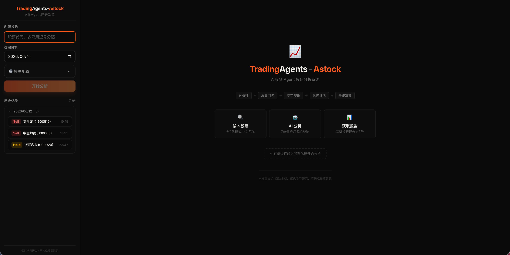

<h1 align="center">TradingAgents-Astock</h1>

<p align="center">
  <strong>多 Agent LLM 协作的 A 股投研框架</strong><br>
  <sub>7 位 AI 分析师 → 多空辩论 → 三方风控 → 投资决策</sub>
</p>

<p align="center">
  <a href="https://github.com/TauricResearch/TradingAgents">TauricResearch/TradingAgents</a>（65K ⭐）的 A 股深度特化 Fork<br>
  Apache 2.0 开源 · <code>pip install</code> 即跑 · 零外部付费依赖
</p>

<p align="center">
  <b>⚠️ 免责声明：本项目仅供学习研究与技术演示，不构成任何投资建议。</b>
</p>

<p align="center">
  <a href="https://github.com/simonlin1212/tradingagents-astock/stargazers"></a>
  <a href="https://github.com/simonlin1212/tradingagents-astock/network/members"></a>
  <a href="https://arxiv.org/abs/2412.20138"></a>
  <a href="./LICENSE"></a>
  <a href="https://pypi.org/project/tradingagents-astock/"></a>
</p>

---

## 为什么做这个 Fork

原版 [TradingAgents](https://github.com/TauricResearch/TradingAgents) 完全面向美股市场。本 Fork 从三个维度落地 A 股：

| 维度 | 原版 | 本 Fork |
|------|------|---------|
| **数据源** | Yahoo Finance / Alpha Vantage | mootdx + 东方财富 + 新浪 + 腾讯 + 同花顺（全免费 HTTP 直连） |
| **分析师** | 4 个（市场/情绪/新闻/基本面） | **7 个**：+ 政策分析师 / 游资追踪 / 解禁监控 |
| **交易规则** | 美股（T+0、无涨跌停） | A 股（T+1、涨跌停、整手买卖） |
| **基准** | SPY | 沪深 300（CSI 300） |
| **输出语言** | 英文 | 中文报告（内部辩论保持英文） |
| **部署方式** | CLI | CLI + Web UI + Docker |

---

## 架构概览

```
用户输入 A 股代码（支持中文名称/拼音）
              │
              ▼
┌─────────────────────────────────────────────────┐
│       7 位 Analyst 研报生成（带工具调用循环）         │
│  Market → Social → News → Fundamentals           │
│  → Policy → Hot Money → Lockup                   │
├─────────────────────────────────────────────────┤
│          质量门控：硬校验 + LLM 复审                 │
├─────────────────────────────────────────────────┤
│        Bull ↔ Bear 多空辩论（可配轮数）             │
├─────────────────────────────────────────────────┤
│     Research Manager 综合裁决（Deep Think）        │
├─────────────────────────────────────────────────┤
│        Trader 交易方案（A 股 T+1/涨跌停约束）        │
├─────────────────────────────────────────────────┤
│  Aggressive ↔ Conservative ↔ Neutral 三方风控辩论  │
├─────────────────────────────────────────────────┤
│   Portfolio Manager 最终决策（Deep Think）         │
│   Buy / Overweight / Hold / Underweight / Sell    │
└─────────────────────────────────────────────────┘
```

**双 LLM 分层**：`quick_think_llm` 驱动 Analyst / Researcher / Trader / Risk Debater；`deep_think_llm` 驱动 Research Manager 和 Portfolio Manager。

---

## 7 位 AI 分析师

| 角色 | 职责 |
|------|------|
| 🏪 **市场分析师** | K 线形态、量价关系、技术指标（MACD/RSI/布林带）、北向资金 |
| 💬 **社交媒体分析师** | 散户情绪、热门题材、资金流向、概念板块归属 |
| 📰 **新闻分析师** | 行业新闻、公司公告、龙虎榜、监管问询、全球宏观 |
| 📊 **基本面分析师** | 财报三表、盈利能力、估值、一致预期、同业对比 |
| 🏛️ **政策分析师** * | 国务院/部委/产业政策/货币政策/监管动态 |
| 🔥 **游资追踪师** * | 龙虎榜席位画像、主力资金流向、游资接力模型 |
| 🔓 **解禁监控师** * | 限售股解禁、大股东减持、减持新规评估 |

> \* 为 A 股特化新增角色。所有 7 份报告流入后续辩论与决策。

---

## 数据源

全部免费，无需 API Key，无积分墙：

| 来源 | 协议 | 用途 |
|------|------|------|
| **mootdx**（通达信） | TCP 7709 | K线、财务快照、F10 文本、代码映射 |
| **腾讯财经** | HTTP | PE/PB/市值/换手率（实时） |
| **东方财富** | HTTP（push2 / datacenter / np-weblist） | 行情、资金流、龙虎榜、解禁、新闻 |
| **新浪财经** | HTTP | K线历史、财报三表 |
| **同花顺 10jqka** | HTTP | EPS 一致预期、热门题材、北向资金 |
| **财联社 cls.cn** | HTTP | 全球财经快讯 |
| **百度股市通** | HTTP | 概念板块分类 |

---

## 快速开始

### 1. 安装

```bash
git clone https://github.com/simonlin1212/tradingagents-astock.git
cd tradingagents-astock
pip install -e .

# 如需 Google Gemini（避免 httpx 版本冲突，单独安装）：
pip install -e ".[google]"
```

### 2. 配置 LLM API Key

创建 `.env` 文件，至少配置一个供应商：

```bash
# 国内直连
MINIMAX_API_KEY=sk-xxx          # https://platform.minimaxi.com/
DEEPSEEK_API_KEY=sk-xxx         # https://platform.deepseek.com/
ZHIPU_API_KEY=xxx               # https://open.bigmodel.cn/
DASHSCOPE_API_KEY=sk-xxx        # https://dashscope.console.aliyun.com/

# 国际供应商
OPENAI_API_KEY=sk-xxx           # https://platform.openai.com/
ANTHROPIC_API_KEY=sk-ant-xxx    # https://console.anthropic.com/
```

### 3. 运行分析

```python
from tradingagents.graph.trading_graph import TradingAgentsGraph

config = {
    "llm_provider": "deepseek",
    "deep_think_llm": "deepseek-v4-pro",
    "quick_think_llm": "deepseek-v4-flash",
    "output_language": "Chinese",
}

ta = TradingAgentsGraph(debug=True, config=config)
final_state, decision = ta.propagate("688017", "2026-05-12")
print(decision)  # Buy / Hold / Sell
```

> 支持 11 个 LLM 供应商：MiniMax / DeepSeek / Qwen / GLM / OpenAI / Anthropic / Google / xAI / Ollama / Azure / Kimi。完整模型列表见 `tradingagents/llm_clients/model_catalog.py`。单次分析约 30–50 次 LLM 调用，必须使用 API Key 模式。

也可以使用 CLI 交互模式：`tradingagents`

---

## 部署

### Docker

```bash
docker compose build
docker compose up -d
# 访问 http://localhost:8000
```

内置文泉驿微米黑中文字体，PDF 导出开箱可用。数据持久化到 `.tradingagents/`，`.env` 挂载进容器。

### 本地开发

```bash
bash dev.sh                              # 一键启动前后端

# 或分步启动：
python -m mootdx bestip
python -m uvicorn backend.main:app --host 0.0.0.0 --port 8000 --reload
cd frontend && pnpm install && pnpm run dev
```

---

## Web UI

内建 React + FastAPI 全栈界面。特点：

- **模型自选**：侧边栏切换 LLM 供应商/模型，支持自定义 API Base URL
- **中文名称解析**：输入"贵州茅台"自动解析为 600519
- **多任务队列**：可同时提交多只股票，后台排队分析
- **实时进度**：12 阶段 pipeline 可视化，已完成阶段的报告可展开查看
- **完整报告**：五档信号卡片 + 7 份分析师报告 + 多空辩论 + 风控评估
- **历史记录**：自动保存并展示所有历史分析
- **报告导出**：支持 Markdown（零依赖）和 PDF（跨平台中文适配）

<p align="center">
  
</p>

API 文档：启动后端后访问 `http://localhost:8000/docs`

---

## 配置参考

| 参数 | 默认值 | 说明 |
|------|--------|------|
| `llm_provider` | `"deepseek"` | LLM 供应商 |
| `deep_think_llm` | `"deepseek-v4-pro"` | Research Manager + Portfolio Manager 模型 |
| `quick_think_llm` | `"deepseek-v4-flash"` | Analyst / Researcher / Trader / Risk Debater 模型 |
| `backend_url` | `None` | 自定义 API 端点 / 中转网关 |
| `output_language` | `"Chinese"` | 报告输出语言 |
| `max_debate_rounds` | `1` | Bull ↔ Bear 辩论轮数 |
| `max_risk_discuss_rounds` | `1` | 三方风控辩论轮数 |
| `checkpoint_enabled` | `False` | 启用 SQLite 检查点断点续跑 |
| `data_cache_dir` | `~/.tradingagents/cache` | 数据缓存目录 |
| `results_dir` | `~/.tradingagents/logs` | 结果日志目录 |
| `memory_log_max_entries` | `None` | 记忆日志最大条数 |

环境变量：`TRADINGAGENTS_CACHE_DIR` | `TRADINGAGENTS_RESULTS_DIR` | `EM_MIN_INTERVAL`（东财限流间隔，默认 1.0s） | `BACKEND_URL`

---

## 项目结构

```
TradingAgents-Astock/
├── tradingagents/
│   ├── agents/          # Agent 层：7 分析师 + 研究员 + 风控 + 管理者 + 交易员
│   ├── dataflows/       # 数据层：A 股 API 直连（a_stock.py ~2200 行）
│   ├── graph/           # LangGraph 流程编排：拓扑/传播/条件路由/信号/反思/检查点
│   ├── llm_clients/     # LLM 工厂：OpenAI / Anthropic / Google / Azure 多供应商适配
│   └── default_config.py
├── backend/             # FastAPI：任务队列 / 历史记录 / PDF 导出
├── frontend/            # React + TypeScript + Tailwind + Radix UI
├── pyproject.toml
├── Dockerfile / docker-compose.yml
└── dev.sh
```

---

## 致谢

本项目基于 [TauricResearch/TradingAgents](https://github.com/TauricResearch/TradingAgents) —— [TradingAgents: Multi-Agents LLM Financial Trading Framework](https://arxiv.org/abs/2412.20138)。

相关项目：[a-stock-data](https://github.com/simonlin1212/a-stock-data) — A 股 MCP 数据服务。

---

## 许可证

[Apache License 2.0](./LICENSE)。继承自上游项目，修改内容详见 [NOTICE](./NOTICE) 和 [CHANGELOG.md](./CHANGELOG.md)。
